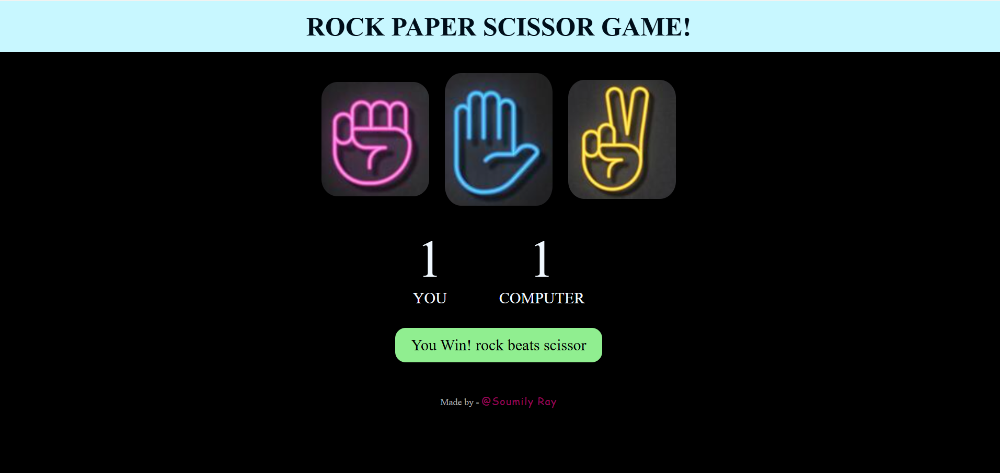

# Rock Paper Scissors Game 🎮✊🖐✌️

A fun and interactive **Rock-Paper-Scissors** game built using **HTML, CSS, and JavaScript**. Challenge the computer and test your luck and strategy!

## Table of Contents 📑

1. [Game Description](#game-description)
2. [Features](#features)
3. [Game Rules](#game-rules)
4. [How It Works](#how-it-works)
5. [Technologies Used](#technologies-used)
6. [How to Play](#how-to-play)

## Game Description 🎯

Rock-Paper-Scissors is a classic hand game played between **two players**. In this web version, you play against the computer. Each round, you choose **Rock**, **Paper**, or **Scissors**, and the computer randomly chooses as well. The game then determines the winner.

---

## Features ✨

* **Interactive buttons** for Rock, Paper, and Scissors.
* **Score tracking** for both user and computer.
* **Real-time game results**: Win, Lose, or Draw.
* **Responsive design** for all devices.
* Easy to **understand and play**.

---

## Game Rules 📜

* Rock **beats** Scissors
* Scissors **beats** Paper
* Paper **beats** Rock
* If both choose the same, it’s a **draw**.

---

## How It Works ⚙️

1. User selects a choice by clicking a button.
2. The computer randomly generates its choice.
3. JavaScript compares both choices and determines the winner.
4. Scores update and a message is displayed to show the result.

---

## Technologies Used 🛠️

* **HTML** – Game structure.
* **CSS** – Styling, animations, and responsive layout.
* **JavaScript** – Game logic, event handling, and score tracking.

---

## How to Play ▶️

1. Open the game in any web browser.
2. Click on **Rock**, **Paper**, or **Scissors**.
3. Watch the computer’s choice.
4. See who wins the round and track scores.

---

## Game Screenshots 📸

### 1️⃣ Draw
  
*Both player and computer chose the same. Result: Draw.*

### 2️⃣ User Wins
  
*User wins this round!*

### 3️⃣ User Loses
  
*Computer wins this round!*

